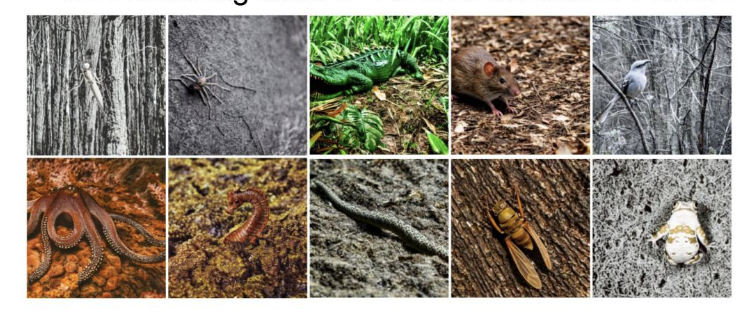

# Enhancing Camouflaged Object Segmentation in Limited Data Setting

This repository is for the final project of CS670 at UMass.

In this project, we explored different data augmentation techniques for handling Camouflaged Object Segmentation.

The essence of image segmentation and detection is to find objects that stand-out or are different from their background, which is also how humans often imagine "objects''. 
But what if an object does not want to be found? Camouflaged objects tend to blend-in with their surroundings by using similar colors and textures. Natural selection has allowed many species to evolve and use sophisticated camouflage mechanisms to avoid detection by predators. Soldiers use camouflage to move covertly and avoid detection by enemies. 

We address the problem of detecting these objects that expressly wish to avoid detection. Camouflaged objects are abundant in nature and can be extremely challenging to detect, even for humans. Advancements on this problem can help real-world applications like search and rescue operations, tracking aquatic species, ecological surveys, and defect detection. However, unlike generic object detection datasets, benchmark datasets for Camouflaged Object Detection (COD) are relatively smaller and may lack diversity. In this project, we aim to explore various methods to alleviate this limitation and catalyze future research in this area.

## Existing SINet baseline

The baseline model that we used in this project is the SINet model proposed in 2019 which implements the human eye's procedure of searching and detecting camouflaged objects. More details can be found [here](https://dengpingfan.github.io/pages/COD.html).

## Datasets
- [COD10K](https://dengpingfan.github.io/pages/COD.html)
- Chameleon
- CAMO

## Style Transfer Augmentation

- Style transfer is used to transfer styles of some natural textures onto the existing images of the datasets, in order to increase the training data.
- After conducting ablations studies with several natural textures, we identified 5 which work very well with most images and produce new styled images while keeping the content mostly intact and camouflaged.

## Synthetic Data using Stable Diffusion

- The existing benchmark datasets have been assembled from flicker images and manually annotating them from experts.
- We explored the potential of using generative AI models (stable diffusion in this case) to generate images using text prompts for datasets with the goal of generating data needed for the problem and reduce data collection and annotation effort.
- We experimented with a few different prompts and choose to use a fixed prompt template "a photo of a ____ colored in  ____ forest with matching texture'', where we vary the color of the object and the forest (same color for the two) and we repeat this for all the animals present in the COD10K dataset. 

In order to reproduce the above result, you can run the [demo.ipynb](https://github.com/VinitraMk/UMass-CS670-Project/blob/dev/demo.ipynb) file.

## Weakly supervised Object Segmentation

- Explored weakly supervised learning for camouflaged object detection, addressing challenges like scarcity of annotated data and its implications for anomaly and defect detection.
- Trained a ResNet-18 model on a binary classification task with camouflaged and non-camouflaged images, achieving ~90% accuracy. We then proceeded to use Grad-CAM to visualize what the model "sees".
- Investigated extensions such as multi-class classification, Vision Transformers, and integrating annotated masks to enhance model supervision.

## Results

